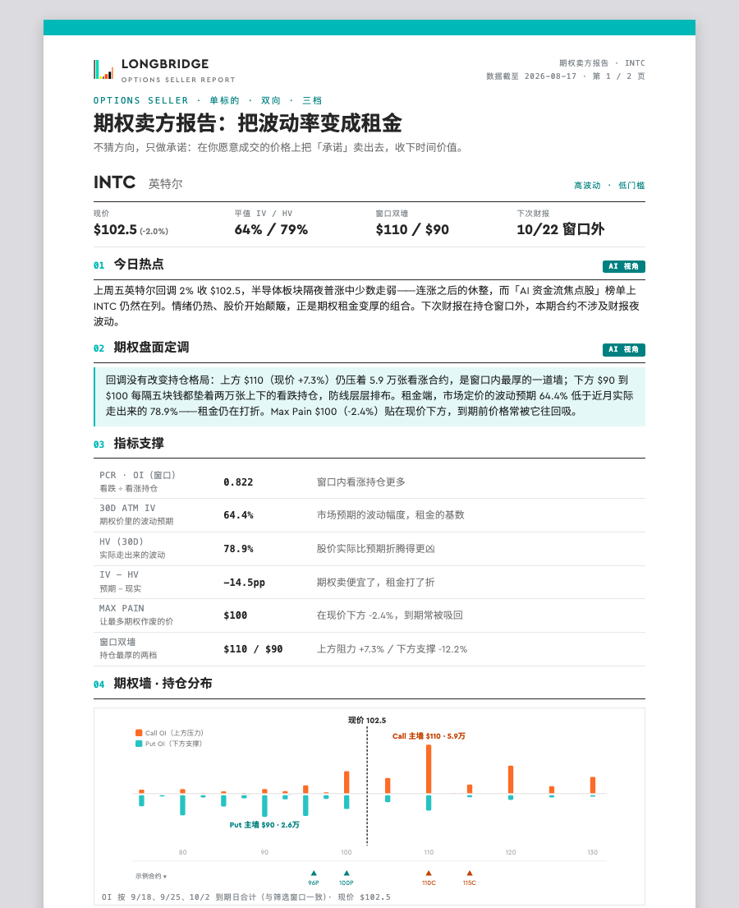
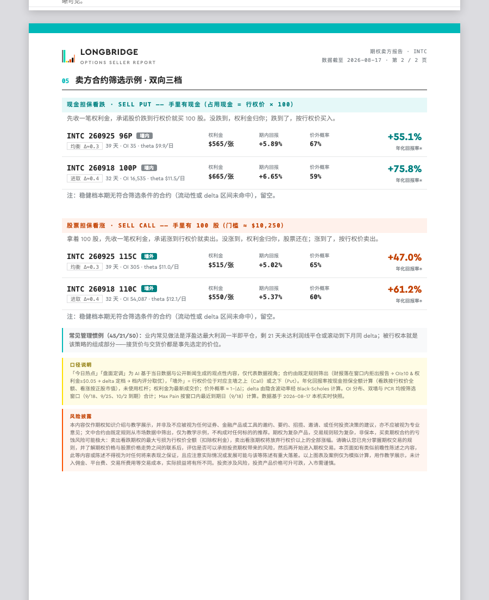

# Options Seller · 期权卖方分析筛选工具

> 基于 **[Longbridge CLI](https://longbridge.com)** 打造的美股期权卖方（sell put / covered call）分析与筛选工具。
> 输入一个标的，在你自己的电脑上用你自己的行情权限，一两分钟生成一份双页专业报告——不猜方向，把波动率变成租金。

```
python3 run.py NVDA        # 或者对 Claude 说：出一份 NVDA 的卖方报告
```

| 第 1 页 · 盘面与期权墙 | 第 2 页 · 双向三档筛选 |
|---|---|
|  |  |

## 它做什么

给"想靠卖期权收租金"的投资者一张开仓前的作战地图：

- **双向三档合约筛选**：现金担保看跌（sell put）与股票担保看涨（covered call）各三档——稳健 Δ≈0.2 / 均衡 Δ≈0.3 / 进取 Δ≈0.4，配 30–45 天到期日阶梯，贴合业内 45/21/50 管理惯例
- **期权墙 · 持仓分布图**：窗口内全部行权价的 Call/Put 未平仓合约（OI）分布，主墙位置与厚度一目了然，示例合约在图上直接标位
- **租金定价**：30 天平值 IV 对比实际走出来的 HV，判断权利金是贵是便宜；窗口 PCR、Max Pain 一并给出
- **财报硬闸门**：下次财报若落在持仓窗口内，工具直接拒绝出报告——期权卖方最忌财报夜，这条规则不接受商量
- **每张合约给全关键数**：权利金/张、期内回报、年化回报率（现金担保全额口径）、价外概率、theta/日、OI、墙内外标注

报告成品可直接点击改字（自动保存在浏览器）、一键导出分享、打印成 A4 PDF。

## 为什么用 Longbridge CLI 来做

这个工具是"**一个 CLI + 纯 Python 标准库**"能走多远的一次完整示范——没有后端、没有数据库、没有 pip 依赖：

| 报告里的每个数字 | 来自哪条命令 |
|---|---|
| 现价、涨跌幅 | `longbridge quote INTC.US` |
| 到期日列表、行权价、平值 IV | `longbridge option chain INTC.US [--date ...]` |
| 每张合约的权利金 / IV / OI | `longbridge option quote <合约> ... --format json` |
| 历史波动率 HV | `longbridge kline INTC.US --period day` |
| 财报闸门 | `longbridge finance-calendar report --symbol ...` |
| 热点素材 | `longbridge news INTC.US` |

`--format json` 让每条命令都是干净的数据接口；delta 和价外概率由本地 Black-Scholes 从 IV 现算（r=2.5%，与长桥 App 展示口径对过账）。所有计算都发生在你的机器上、用你账户的行情权限——工具作者看不到你查了什么。

## 安装（三步）

1. **安装并登录 longbridge CLI**（需要长桥账户，且已开通**美股期权行情**）
2. 获取本工具，二选一：
   ```
   # Claude Code 插件市场
   /plugin marketplace add hey997064-sys/options-seller
   /plugin install options-seller@options-seller-market
   ```
   ```bash
   # 或直接下载（不用 Claude 也行）
   git clone https://github.com/hey997064-sys/options-seller.git
   ```
   （GitHub 页面 Code → Download ZIP 亦可，脚本在 `options-seller/skills/options-seller/scripts/`）
3. 环境自检（首次）：`python3 scripts/doctor.py`——CLI/登录态/期权行情权限四连检，哪项缺给哪项的修复指引

## 使用（按你手里有什么 AI，三选一）

**A · 有 Claude Code / Cowork**（全自动，体验最好）

> 出一份 NVDA 的卖方报告 / 帮我看看 TSLA 能卖什么期权 / /options-seller INTC

热点与盘面解读段由 AI 撰写，页面挂「AI 视角」标。

**B · 用别的 AI 助手**（ChatGPT / Kimi / 豆包等都行）

```bash
python3 scripts/run.py NVDA
```

先得到"自动摘要"版报告；想升级 AI 解读，把 [PROMPT.md](options-seller/skills/options-seller/PROMPT.md) 全文 + 生成的 `seller_data.json` 发给你的 AI，把它返回的 JSON 存为 `segments.json`，再跑一次 `scripts/build_report.py`。

**C · 完全不用 AI**（一条命令）

同上 `run.py NVDA` 直接用：合约筛选、期权墙、KPI 全部照常（这些本来就是机械规则），两段文字为固定规则生成的数据陈述，页面挂「自动摘要」标以示区分。

**三种用法下合约行、图表与指标完全一致——AI 只负责两段解读文字，从不碰数字。**

## 筛选规则（全透明，写死在代码里）

避开财报（窗口内有财报直接拒跑）→ 流动性闸（OI≥10 且权利金≥$0.05）→ 分池（看跌只看现价下方、看涨只看上方）→ delta 定档 × 到期日阶梯 → 档内按"留住本金概率 × 时间效率 × 收益率"评分取优 → 主墙内外标注。某档无合格合约时明确标注留空，不硬凑。

数据被中途篡改会被恒等式断言拦下拒绝渲染；每个失败场景都有人话解释和明确退出码（详见 [SKILL.md](options-seller/skills/options-seller/SKILL.md)）。发版前跑 `tests/run_tests.sh`——30 项离线回归，Python 3.9/3.14 双验证。

## 出问题了？

| 现象 | 原因与处理 |
|---|---|
| 提示无期权行情权限 | 在长桥 App 行情商店开通美股期权行情（按账户开通，本工具无法代开） |
| 提示财报在窗口内拒跑 | 设计行为：财报夜波动会击穿卖方策略。换标的或等财报后再跑 |
| 提示窗口内无到期日 | 该标的只有远月期权，不符合 30–45 天开仓窗，换标的 |
| 个别报价块失败 warn | 网络抖动，OI 分布可能不完整，重跑一次即可 |
| 其他报错 | 先跑 `python3 scripts/doctor.py`，能定位绝大多数问题 |

## 依赖与边界

- 仅美股标的（支持 BRK.B 类带点代码）；纯 Python 标准库，无 pip 依赖；macOS / Linux
- 口径：年化回报按现金担保全额计算（看跌按行权价全额、看涨按正股市值），未使用杠杆；价外概率 ≈ 1−|Δ|
- **本工具输出为教学示例与数据展示，不构成任何投资建议**；期权为复杂产品，非保本，卖方亏损风险可能极大——完整风险披露见每份报告页尾

## 版本

见 [CHANGELOG](CHANGELOG.md)。
